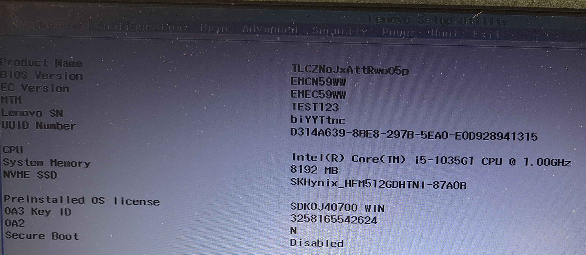
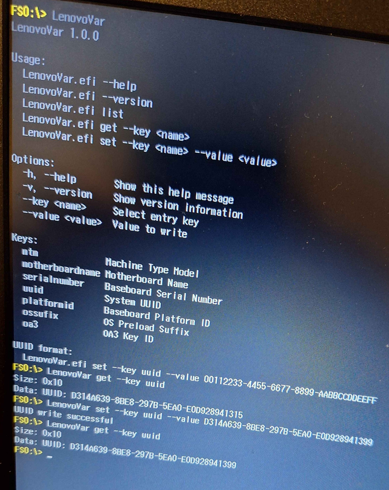
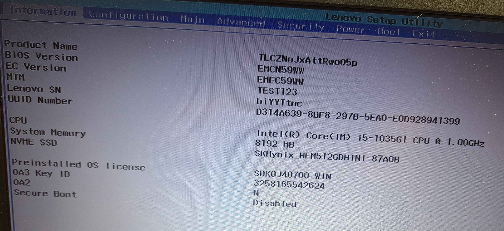

# LenovoVar

**LenovoVar** is a UEFI application for reading and modifying SMBIOS-related data on Lenovo systems using the proprietary Lenovo variable storage protocol.

It is mostly based on my reverse engineering work from:
https://github.com/Shmurkio/LenovoDMIDecryptor

---

## Features

* Read SMBIOS-related firmware entries (e.g. UUID, MTM, serial number)
* Modify selected entries directly from the UEFI shell
* Command-line interface with structured options (`--key`, `--value`)
* Proper handling of binary fields such as UUID (GUID format)

---

## Usage

```text
LenovoVar.efi --help
LenovoVar.efi list
LenovoVar.efi get --key uuid
LenovoVar.efi set --key uuid --value 00112233-4455-6677-8899-AABBCCDDEEFF
```

### Supported keys

* `mtm` — Machine Type Model
* `motherboardname` - Motherboard Name
* `serialnumber` — Baseboard Serial Number
* `uuid` — System UUID
* `platformid` — Baseboard Platform ID
* `ossufix` — OS Preload Suffix
* `oa3` — OA3 Key ID

More keys may be added in future updates as additional entries are discovered through reverse engineering.

---

## Showcase

### SMBIOS data before editing



### Changing the UUID



### SMBIOS data after editing



---

## Disclaimer

This project is based entirely on reverse-engineered Lenovo InsydeH2O firmware.

* There is no guarantee that it will work correctly on all Lenovo systems.
* Firmware modifications always carry a risk of system instability or data loss.

**Use at your own risk.**

---

## Precompiled Binary

A precompiled binary is available on the **GitHub Releases** page.