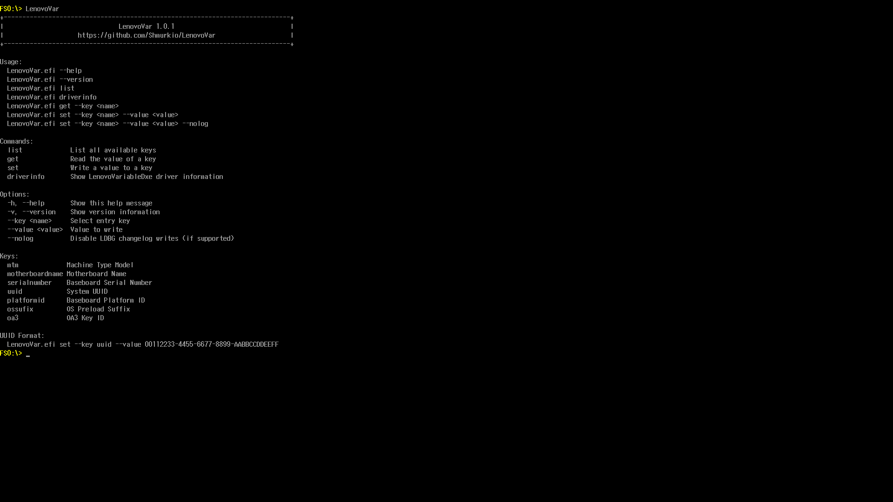
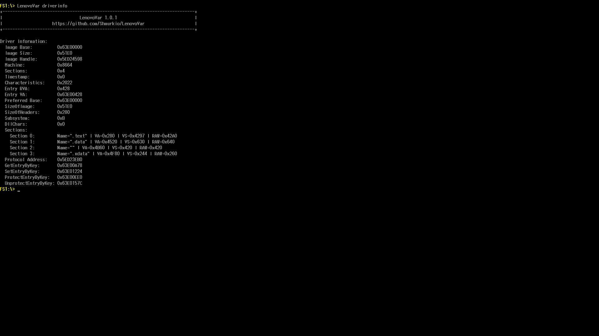
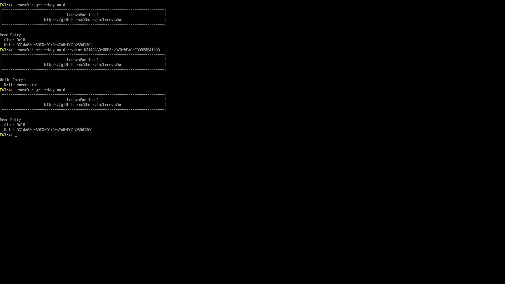

# LenovoVar

**LenovoVar** is a UEFI application for reading and modifying SMBIOS-related data on Lenovo systems using the proprietary Lenovo variable storage protocol.

It is mostly based on my reverse engineering work from:
[LenovoDMIDecryptor](https://github.com/Shmurkio/LenovoDMIDecryptor)

---

## Features

* Read SMBIOS-related firmware entries (e.g. UUID, MTM, serial number)
* Modify selected entries directly from the UEFI shell
* Command-line interface with structured options (`--key`, `--value`)
* Proper handling of binary fields such as UUID (GUID format)
* Display detailed information about the `LenovoVariableDxe` driver (`driverinfo`)
* Optional suppression of LDBG changelog writes (`--nolog`)

---

## Usage

```text
LenovoVar.efi --help
LenovoVar.efi --version

LenovoVar.efi list
LenovoVar.efi driverinfo

LenovoVar.efi get --key <name>
LenovoVar.efi set --key <name> --value <value>
LenovoVar.efi set --key <name> --value <value> --nolog
```

---

## Commands

* `list` — List all available keys
* `get` — Read the value of a key
* `set` — Write a value to a key
* `driverinfo` — Display detailed information about the Lenovo DXE driver

---

## Options

* `-h`, `--help` — Show help message
* `-v`, `--version` — Show version information
* `--key <name>` — Select entry key
* `--value <value>` — Value to write
* `--nolog` — Disable LDBG changelog writes (if supported)

---

## Supported keys

* `mtm` — Machine Type Model
* `motherboardname` — Motherboard Name
* `serialnumber` — Baseboard Serial Number
* `uuid` — System UUID
* `platformid` — Baseboard Platform ID
* `ossufix` — OS Preload Suffix
* `oa3` — OA3 Key ID

More keys may be added in future updates as additional entries are discovered.

---

## Showcase

### Help / Command Overview



### Driver Information



### Changing the System UUID



---

## Notes

* The `--nolog` option works by detouring the internal function responsible for writing LDBG change records. 
* This prevents entries from being logged in the firmware changelog (if the hook succeeds).

---

## Disclaimer

This project is based entirely on reverse-engineered Lenovo InsydeH2O firmware.

* There is no guarantee that it will work correctly on all Lenovo systems
* Firmware modifications always carry a risk of system instability or data loss
* Changing data sizes arbitrarily may corrupt firmware data or even brick the BIOS, as Lenovo variable entries are partially mapped to SMBIOS structures using offset-based mechanisms

**Use at your own risk.**

---

## Precompiled Binary

A precompiled binary is available on the **GitHub Releases** page.